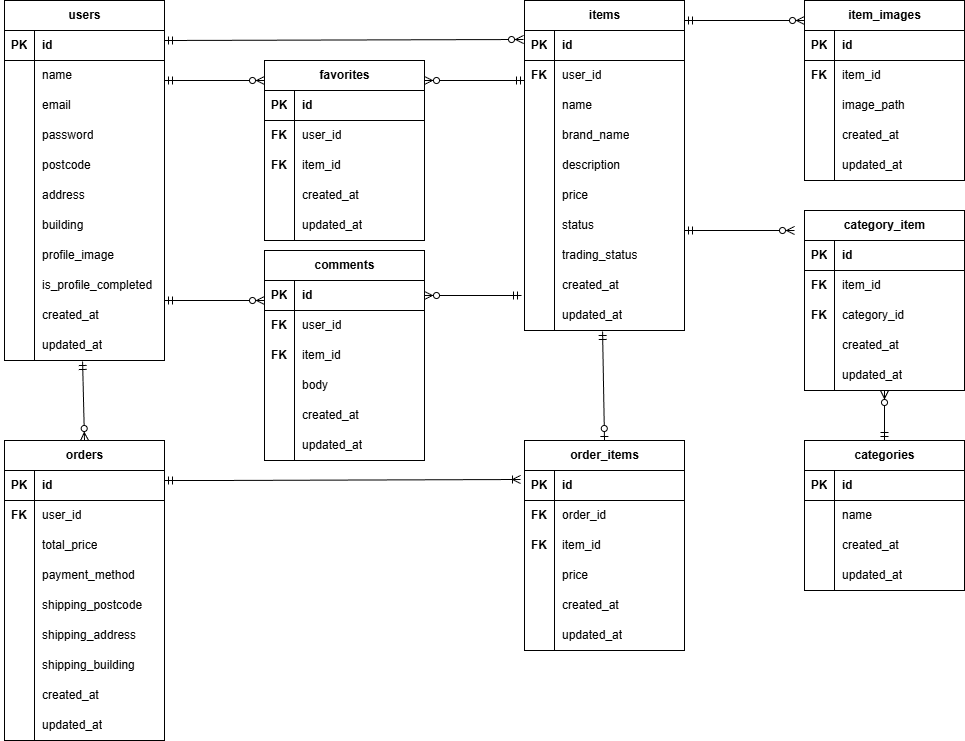

# 模擬案件＿フリマアプリ

## 概要

本アプリは、アイテムの出品と購入を行うためのフリマアプリです。

## 環境構築

### ・Dockerビルド

```
git clone git@github.com:saku-taro/sakuda-mogi-fleamarket.git
```

```
docker-compose up -d --build
```

### ・Laravel環境構築

```
docker-compose exec php bash
```

```
composer install
```

```
cp .env.example .env
```

---

・「.envファイル」の環境変数は次の通りの通り

```
DB_CONNECTION=mysql
DB_HOST=mysql
DB_PORT=3306
DB_DATABASE=laravel_db
DB_USERNAME=laravel_user
DB_PASSWORD=laravel_pass
```

---

```
php artisan key:generate
```

```
php artisan storage:link
```

```
php artisan migrate
```

```
php artisan db:seed
```

## 使用技術(実行環境)

・PHP 8.5.3  
・Laravel 8.83.8  
・MySQL 11.8.3  
・nginx 1.21.1  
・mailhog

## URL

・商品一覧画面(トップ画面)：http://localhost/  
・会員登録画面：http://localhost/register  
・ログイン画面：http://localhost/login  
・phpMyAdmin：http://localhost:8080/

## ER図


